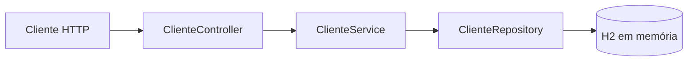

# API REST Java EMR


## Visão Geral

API REST em Java/Spring Boot para cadastro e gestão de clientes — base inicial para um sistema de **prontuário eletrônico (EMR — Electronic Medical Record)**. O repositório implementa um CRUD completo (criar, listar, buscar, atualizar e excluir) sobre a entidade `Cliente` (nome e e-mail), servindo como ponto de partida para evoluir para uma solução de gestão de cadastros de pacientes.

O código segue o padrão de camadas do Spring Boot — Controller → Service → Repository → banco de dados — com persistência em **H2 em memória** e console web para inspeção durante o desenvolvimento.

## Tecnologias Utilizadas

| Categoria | Tecnologia | Uso no projeto |
|---|---|---|
| Linguagem | Java 23 | Toda a lógica da aplicação |
| Framework | Spring Boot 3.4.3 | Estrutura base da aplicação |
| Persistência | Spring Data JPA / Hibernate | Mapeamento objeto-relacional e repositórios |
| Banco de Dados | H2 (em memória) | Armazenamento durante o desenvolvimento |
| Build | Maven | Compilação, dependências e execução |

## Arquitetura & Funcionalidades

Fluxo das requisições:

```
Cliente (HTTP) → ClienteController → ClienteService → ClienteRepository → H2 (mem)
```

**Funcionalidades implementadas:**

- **CRUD completo de clientes**: criação (`POST`), listagem (`GET`), busca por ID (`GET /{id}`), atualização (`PUT /{id}`) e exclusão (`DELETE /{id}`).
- **Tratamento de erros**: retorno `404 Not Found` quando o cliente não existe em busca/atualização/exclusão.
- **Persistência JPA**: entidade `Cliente` (id, nome, email) mapeada para a tabela `clientes` com `ddl-auto=update`.
- **Console H2**: acesso via navegador em `/h2-console` para inspeção do banco.



## Instalação e Configuração

**Pré-requisitos:**

- JDK 23+
- Maven (ou use o `./mvnw` fornecido)

Clone e compile:

```bash
git clone git@github.com:Macorfilho/api-rest-java-emr.git
cd api-rest-java-emr
./mvnw clean package
```

**Configuração:** definida em `src/main/resources/application.properties` — porta `8080`, banco H2 em memória (`jdbc:h2:mem:testdb`), console H2 habilitado em `/h2-console` e `ddl-auto=update` para o JPA.

## Como Executar / Exemplos de Uso

```bash
./mvnw spring-boot:run
```

A aplicação sobe em `http://localhost:8080`. Console H2: `http://localhost:8080/h2-console` (JDBC URL: `jdbc:h2:mem:testdb`).

**Endpoints da API:**

| Método | Rota | Descrição |
|---|---|---|
| GET | `/clientes` | Lista todos os clientes |
| GET | `/clientes/{id}` | Busca cliente por ID (404 se não existir) |
| POST | `/clientes` | Cria um novo cliente (201 Created) |
| PUT | `/clientes/{id}` | Atualiza um cliente existente |
| DELETE | `/clientes/{id}` | Exclui um cliente (204 No Content) |

**Exemplos com `curl`:**

```bash
# Criar cliente
curl -X POST http://localhost:8080/clientes \
  -H "Content-Type: application/json" \
  -d '{"nome":"Maria Souza","email":"maria@email.com"}'

# Listar clientes
curl http://localhost:8080/clientes

# Buscar por ID
curl http://localhost:8080/clientes/1

# Atualizar
curl -X PUT http://localhost:8080/clientes/1 \
  -H "Content-Type: application/json" \
  -d '{"nome":"Maria Souza","email":"maria.nova@email.com"}'

# Excluir
curl -X DELETE http://localhost:8080/clientes/1
```

## Contato / Créditos

Desenvolvido por Marcelo R. Corner Filho.

- Portfólio: https://marcelocorner.dev
- GitHub: https://github.com/Macorfilho
- LinkedIn: https://www.linkedin.com/in/marcelocorner